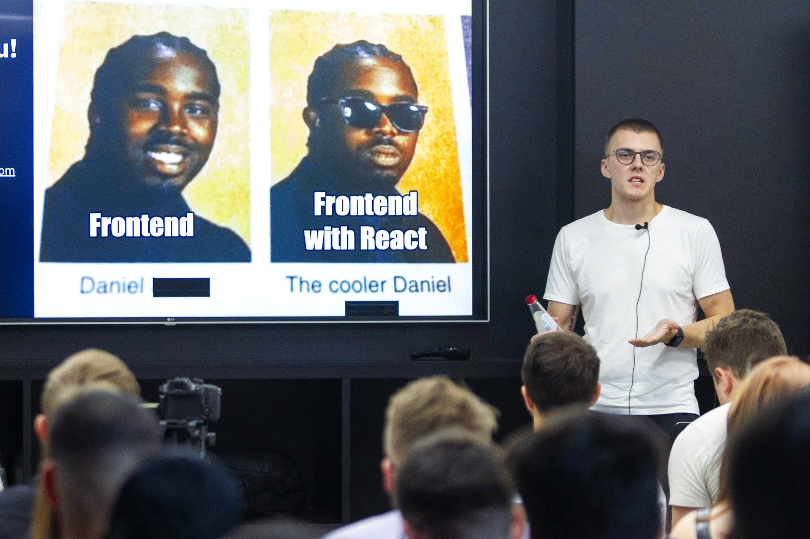

I'm Edvins Antonovs — a front-end engineer and indie maker based in Riga, Latvia.

I'm currently working at [Secondmind](https://secondmind.ai/), a Cambridge-based startup using machine learning to optimise decision-making in automotive engineering.

After hours, I work on various [side projects](/projects), explore new technologies, and [write about code](/blog). One of my recent projects is [Albion Online Grind](https://albiononlinegrind.com) — a tool that helps players improve their economy in the popular sandbox MMORPG, Albion Online. I also founded [Stealth Labs](https://www.stealthlabs.dev/) — a super professional and serious software development company.

I'm a passionate advocate of the ["learning in public"](https://www.swyx.io/learn-in-public/) movement and track my [learning journey](/self-education). I'm always looking for ways to improve my skills and knowledge, and I'm not afraid to share my experiences (even the failures) with the world.

My first talk at DevClub.lv meetup back in 2023.

---

### Random facts about me

- My work experience spans agencies, outsourcing, startups, scale-ups, and enterprises. I thrive on collaborating with passionate individuals.
- Beyond code, I find joy in [reading](https://www.goodreads.com/user/show/80549857-edvins-antonovs), [running](https://www.strava.com/athletes/29502472), and cherishing moments with my family.
- My tech stack is in a constant state of evolution. This is [what I've used in 2022](/my-tech-stack). As per 2024, my tech stack for the side-projects reached it's new form: React, TypeScript, Next.js and Supabase.
- In 2023, I presented on ["Maximising Performance with React Code-splitting Techniques"](/my-first-talk) at the [DevClub.lv](https://devclub.lv/) meetup. Speaking engagements are a growing focus, and I'm actively honing my public speaking skills.
- I achieved two half-marathons (2:19:39 and 2:04:14) in 2023 and ran my first marathon in 2024 (5:08:45).
- Coffee and pizza are my true obsessions.
- I recently discovered the world of board games and I'm loving it. My current favourites are Dominion and Carcassonne.
- I'm cultivating discipline by breaking bad habits, embracing positive ones, and striving to be 1% better every day.

---

### Contact me

Want to get in touch or find me elsewhere on the internet?

* <a href="mailto:ummahusla@gmail.com">Email me anytime</a> — I’ve love to hear from you.
* Follow me on X: [@edvinsantonovs](https://x.com/edvinsantonovs)
* See some of my code on [GitHub](https://github.com/ummahusla).
* Connect with me professionally on [LinkedIn](https://www.linkedin.com/in/edvinsantonovs/).
* Follow my running on [Strava](https://www.strava.com/athletes/29502472).
* Follow my reading on [Goodreads](https://www.goodreads.com/user/show/80549857-edvins-antonovs).
