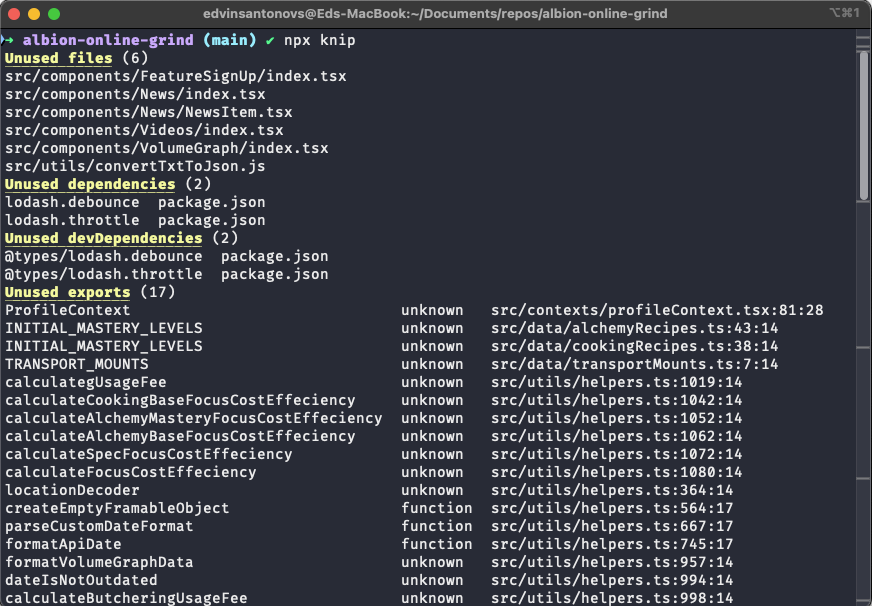
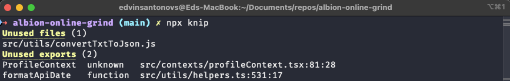

Cleaning up your React codebase can feel like a daunting task, but it’s incredibly rewarding. Over time, projects tend to accumulate unused files and dependencies, which can clutter your workspace and make maintaining your app harder. Recently, I needed to clean up my project and decided to focus on finding files that were no longer used. Instead of manually digging through the codebase, I found a better way with the npm package [knip](https://www.npmjs.com/package/knip).

Using **knip** is simple and effective. After installing it, all you need is one command: `npx knip`. This tool scans your codebase to identify dead files and dependencies. It highlights any files that are not being imported anywhere in your app, making it easy to spot and remove them. This approach saves hours of manual work and ensures that nothing important gets accidentally deleted. For React developers, tools like **knip** are a game changer, especially when combined with TypeScript or well-structured components.

Once I ran knip, I cleaned up a surprising amount of unused code, which made my app feel much leaner. This process not only simplifies your project but also improves its maintainability. If you're dealing with messy codebases, give tools like **knip**, **depcheck**, or **eslint-plugin-unused-imports** a try. They’re easy to use and incredibly satisfying when you see the results.

