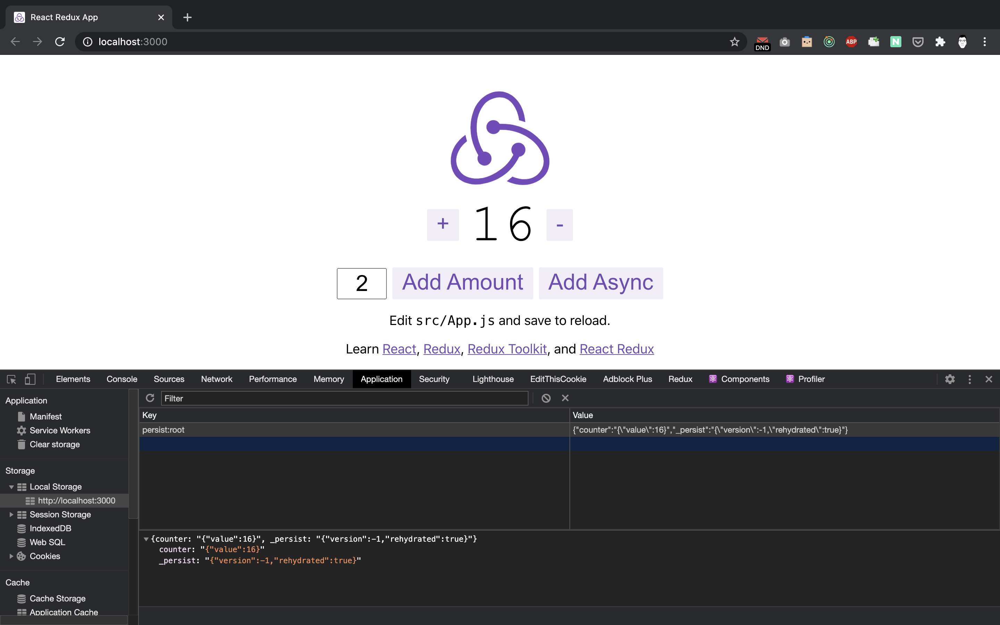

Recently, I've discovered `redux-toolkit` which is the official, opinionated, batteries-included toolset for efficient Redux development. It's intended to be the standard way to write Redux logic. Moreover, redux template for `create-react-app` is now using `redux-toolkit` by default.

Today, I'd like to share a way how to use `redux-persist` with `redux-toolkit`. `redux-persist` gives us an ability to save Redux store in the [Local Storage](https://developer.mozilla.org/en-US/docs/Web/API/Window/localStorage) of the browser. Effectively, when you press the refresh page button in your browser, your storage will remain the same. Obviously, you can define how many levels or which parts of your store you want to make persistant.

<br />

---

<br />

## Initial setup

I will use a fresh copy of the `create-react-app` with `redux-toolkit` being built-in and jump straight to the action.

```
npx create-react-app my-app --template redux
```

### Generated application and file structure

We just genereated our `create-react-app` and we got this file structure as an outcome.

```
├── README.md
├── node_modules
├── package.json
├── public
├── src
└── yarn.lock
```

Therefore, we are interested in `/src/app` folder where we can find `store.js` file.

```
src
├── App.css
├── App.js
├── App.test.js
├── app
│   └── store.js
├── features
│   └── counter
│       ├── Counter.js
│       ├── Counter.module.css
│       └── counterSlice.js
├── index.css
├── index.js
├── logo.svg
├── serviceWorker.js
└── setupTests.js
```

Now, let's have a quick look on `src/app/store.js` and `src/index.js` files. These are 2 files, where we will do all of the required changes.

- `src/app/store.js`

```js
import { configureStore } from '@reduxjs/toolkit';
import counterReducer from '../features/counter/counterSlice';

export default configureStore({
  reducer: {
    counter: counterReducer,
  },
});
```

- `src/index.js`

```js
// ...

import store from './app/store';
import { Provider } from 'react-redux';

ReactDOM.render(
  <React.StrictMode>
    <Provider store={store}>
      <App />
    </Provider>
  </React.StrictMode>,
  document.getElementById('root')
);

// ...
```

<br />

---

<br />

## Implementation

First of all, let's add `redux-persist` as a package (we will need it for later) and run the application in development mode.

```
yarn add redux-persist

yarn start
```

Now, we should be up and running, and we should see our counter example application. You can test out the application to see how it works, and then hit the page refresh button. Then state is refreshed back to the normal and you should see `0` count on the screen, but we want to keep it persistent, right? That's where `redux-persist` steps in!


### Persistable state

Now let's do some changes to the next files.

- `src/app/store.js`

The general idea is on line 18 in `src/app/store.js` you can define, which `reducers` you want to make a persistent. As it's not really a good idea to persist the whole redux state into the local storage.

```js {2-5,9-11,13-16,18,20-24,26}
import { configureStore } from '@reduxjs/toolkit';
import storage from 'redux-persist/lib/storage';
import { combineReducers } from 'redux';
import { persistReducer } from 'redux-persist';
import thunk from 'redux-thunk';

import counterReducer from '../features/counter/counterSlice';

const reducers = combineReducers({
  counter: counterReducer,
});

const persistConfig = {
  key: 'root',
  storage,
};

const persistedReducer = persistReducer(persistConfig, reducers);

const store = configureStore({
  reducer: persistedReducer,
  devTools: process.env.NODE_ENV !== 'production',
  middleware: [thunk],
});

export default store;
```

- `src/index.js`

Here we add `persistStore` and `PersistGate`. `PersistGate` delays the rendering of your app's UI until your persisted state has been retrieved and saved to redux.

```js {3-4,6,11-13}
// ...

import { PersistGate } from 'redux-persist/integration/react';
import { persistStore } from 'redux-persist';

let persistor = persistStore(store);

ReactDOM.render(
  <React.StrictMode>
    <Provider store={store}>
      <PersistGate loading={null} persistor={persistor}>
        <App />
      </PersistGate>
    </Provider>
  </React.StrictMode>,
  document.getElementById('root')
);

// ...
```

Now it's time to test our application! Try to increase or decrease the amount and then hit the page refresh as well as open your developer console and check the local storage setting, where you should see the `amount` value in it.



## Source

Source code is available in this repository - https://github.com/ummahusla/react-redux-toolkit-persist
