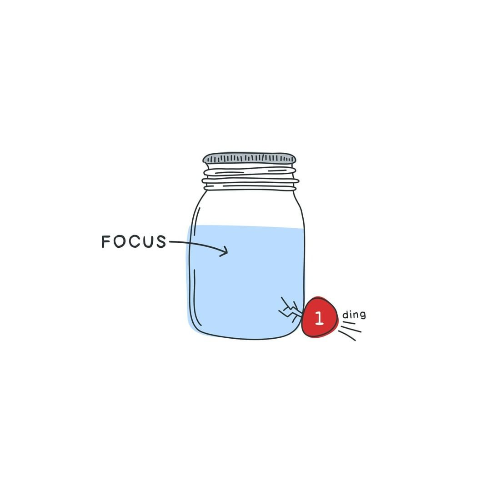

During 2021 I had many ups and downs which affected my **discipline, focus and mental clarity**. These are crucial abilities to succeed in life.

- Become disciplined, indistractable and learn how to deep focus.

  

    Image by{' '}
    <a target="_blank" href="https://twitter.com/OzolinsJanis">
      Janis Ozolins
    </a>
  

**Reading**. The goal is to read two books per month or one book per two weeks.

- Read 24 books 
  <Text sx={{ fontSize: [1], fontWeight: `400`, color: `secondary` }}>
    ↳ I'm interested in are programming, business, psychology, self-help, science, investing,
    philosophy books. All progress can be tracked via{' '}
    <a target="_blank" href="https://www.goodreads.com/user/show/80549857-edvins-antonovs">
      Goodreads
    </a>
    .
  </Text>

**Eating, exercising, and sleeping**. I didn't have consistency in any of those habits last year. This year, I will make sure to improve these core areas as early as possible.

- Drink plenty of water (~1.5l, every day)
- Run (2-3 times per week) 
  <Text sx={{ fontSize: [1], fontWeight: `400`, color: `secondary` }}>
    ↳ All progress is tracked via{' '}
    <a target="_blank" href="https://www.strava.com/athletes/29502472">
      Strava
    </a>
    .
  </Text>
- Do HIIT workout (2-3 times per week)
  <Text sx={{ fontSize: [1], fontWeight: `400`, color: `secondary` }}>
    ↳ All progress is tracked via Seven.
  </Text>
- Stop overeating
- Fast (~13-16 hours, 2-3 times per week)
  <Text sx={{ fontSize: [1], fontWeight: `400`, color: `secondary` }}>
    ↳ All progress is tracked via Zero.
  </Text>

**Writing**. I want to learn how to get better at it and build a writing habit. This blog is a perfect place to practice it.

- Read <a href="https://www.julian.com/guide/write/intro">Julian's</a> handbook on writting well
- Publish 12 blog posts

**Side hustle**. <a target="_blank" href="https://cultivate.so">Cultivate</a> is my side project which I'm shipping this year.

- Ship Cultivate<Text sx={{ fontSize: [1], fontWeight: `400`, color: `secondary` }}>
  ↳ It's a habit tracker application which I use to improve my habits.
  </Text>

**Psychotherapy**. I've started doing it last year. It helped me a lot.

- Continue with doing psychotherapy sessions until it's enough.

**Other things**

- Take control of my finances<Text sx={{ fontSize: [1], fontWeight: `400`, color: `secondary` }}>
  ↳ I've bought variety of books to read about personal finance, investing and F.I.R.E movement.
  </Text>
- Practice radical acceptance
- Solve 3x3 Rubik’s cube<Text sx={{ fontSize: [1], fontWeight: `400`, color: `secondary` }}>
  ↳ One of my goals from 2021 which I failed.
  </Text>
- Run a half-marathon<Text sx={{ fontSize: [1], fontWeight: `400`, color: `secondary` }}>
  ↳ One of my goals from 2021 which I failed.
  </Text>
