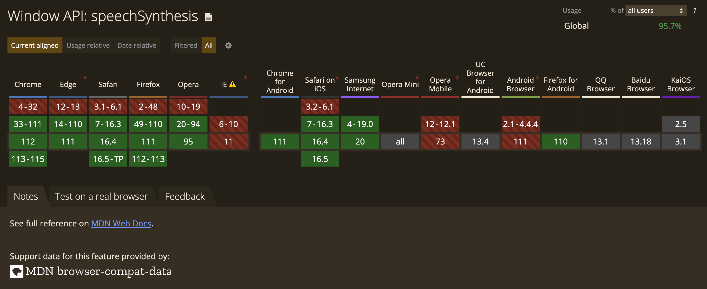

Text-to-speech feature is now available on relatively any website or blog. It's a game changer that you can listen to the content instead of reading it. Especially effective for people with visual or cognitive impairments or on the go. I came up with the idea to implement it for my blog, so this is how I started researching this topic which ended up being a tutorial for you. So in this tutorial, we will go through the process of building a text-to-speech component in React. We will use the `Web Speech API` to implement the text-to-speech functionality.

---

### What we are building

This is what the result will look like.

<iframe
  src="https://codesandbox.io/embed/text-to-speech-demo-umlkzv?fontsize=14&hidenavigation=1&module=%2Fsrc%2FTextToSpeech.js&theme=dark&view=preview"
  style="width:100%; height:500px; border:0; border-radius: 4px; overflow:hidden;"
  title="Text-To-Speech (demo)"
  allow="accelerometer; ambient-light-sensor; camera; encrypted-media; geolocation; gyroscope; hid; microphone; midi; payment; usb; vr; xr-spatial-tracking"
  sandbox="allow-forms allow-modals allow-popups allow-presentation allow-same-origin allow-scripts"
></iframe>

---

### Can I use window.speechSynthesis?



---

### Initial setup

You can use any React boilerplate to get started. I will be using the [Create React App](https://create-react-app.dev/) boilerplate to create a new React app.

You can install it using the following command:

```bash
npx create-react-app text-to-speech
```

Once the app is created, you can start the development server using the following command:

```bash
cd text-to-speech
yarn start
```

---

### Creating the Text-to-Speech component

The first step is to create a new component called `TextToSpeech` that will read the content of our blog post. Let's create a file called `TextToSpeech.js`.

```jsx:title=TextToSpeech.js
import React, { useState, useEffect } from "react";

const TextToSpeech = ({ text }) => {
  const [isPaused, setIsPaused] = useState(false);
  const [utterance, setUtterance] = useState(null);

  useEffect(() => {
    const synth = window.speechSynthesis;
    const u = new SpeechSynthesisUtterance(text);

    setUtterance(u);

    return () => {
      synth.cancel();
    };
  }, [text]);

  const handlePlay = () => {
    const synth = window.speechSynthesis;

    if (isPaused) {
      synth.resume();
    }

    synth.speak(utterance);

    setIsPaused(true);
  };

  const handlePause = () => {
    const synth = window.speechSynthesis;

    synth.pause();

    setIsPaused(true);
  };

  const handleStop = () => {
    const synth = window.speechSynthesis;

    synth.cancel();

    setIsPaused(false);
  };

  return (
    <div>
      <button onClick={handlePlay}>{isPaused ? "Resume" : "Play"}</button>
      <button onClick={handlePause}>Pause</button>
      <button onClick={handleStop}>Stop</button>
    </div>
  );
};

export default TextToSpeech;
```

This code defines a new functional component called `TextToSpeech`. The component takes the `text` prop as input and creates a new `SpeechSynthesisUtterance` object that contains the text to be spoken. The `useEffect` hook is used to initialise the utterance state and cancel any ongoing speech synthesis when the component is unmounted.

The component also defines three event handlers for playing, pausing, and stopping the speech synthesis. When the `Play`/`Resume` button is clicked, the speak method of the `SpeechSynthesis` interface is called to start/resume the speech synthesis. Similarly, the `pause` and `cancel` methods are called when the `Pause` and `Stop` buttons are clicked, respectively.

In case you are curious what we save into `utterance` state, here is the output of the `SpeechSynthesisUtterance` object.

```js
SpeechSynthesisUtterance
text: "Text-to-speech feature is ..."
lang: ""
voice: null
volume: 1
rate: 1
pitch: 1
onstart: null
onend: null
onerror: null
onpause: null
onresume: null
onmark: null
onboundary: null
addEventListener: ƒ addEventListener() {}
dispatchEvent: ƒ dispatchEvent() {}
removeEventListener: ƒ removeEventListener() {}
<constructor>: "SpeechSynthesisUtterance"
```

---

### Usage of the Text-to-Speech component

Okay, so now when we have a basic `TextToSpeech` component created, we can use it in our blog post.

```jsx:title=BlogPost.js {1,10}
import TextToSpeech from './TextToSpeech';

const BlogPost = () => {
  const text =
    "Text-to-speech feature is now available on relatively any website or blog. It's a game changer that you can listen to the content instead of reading it. Especially effective for people with visual or cognitive impairments or on the go. I came up with the idea to implement it for my blog, so this is how I started researching this topic which ended up being a tutorial for you. So in this tutorial, we will go through the process of building a text-to-speech component in React. We will use the `Web Speech API` to implement the text-to-speech functionality.";

  return (
    <div>
      <h1>My Blog Post</h1>
      <TextToSpeech text={text} />
      <p>{text}</p>
    </div>
  );
};

export default BlogPost;
```

---

### Testing the Text-to-Speech Component

Yay, we made it so far so let's test how it works.

<iframe
  src="https://codesandbox.io/embed/text-to-speech-lvphi2?fontsize=14&hidenavigation=1&module=%2Fsrc%2FTextToSpeech.js&theme=dark"
  style="width:100%; height:500px; border:0; border-radius: 4px; overflow:hidden;"
  title="text-to-speech"
  allow="accelerometer; ambient-light-sensor; camera; encrypted-media; geolocation; gyroscope; hid; microphone; midi; payment; usb; vr; xr-spatial-tracking"
  sandbox="allow-forms allow-modals allow-popups allow-presentation allow-same-origin allow-scripts"
></iframe>

Next steps, we can add more features to it, such as changing the speech synthesis's voice, speed, and pitch. We have a lot of options what we can do, but I we will cover the most valuable parts.

---

### Adding voice, speed and pitch controls

To add controls for changing the voice, speed, and pitch of the speech synthesis, we can create new state variables for each of these properties in our `TextToSpeech` component. We can then add input elements to allow the user to adjust these properties.

```js:title=TextToSpeech.js {6-9,14,17,30-33,56-59,61-63,65-67,69-71,75-84,88-98,102-124}
import React, { useState, useEffect } from "react";

const TextToSpeech = ({ text }) => {
  const [isPaused, setIsPaused] = useState(false);
  const [utterance, setUtterance] = useState(null);
  const [voice, setVoice] = useState(null);
  const [pitch, setPitch] = useState(1);
  const [rate, setRate] = useState(1);
  const [volume, setVolume] = useState(1);

  useEffect(() => {
    const synth = window.speechSynthesis;
    const u = new SpeechSynthesisUtterance(text);
    const voices = synth.getVoices();

    setUtterance(u);
    setVoice(voices[0]);

    return () => {
      synth.cancel();
    };
  }, [text]);

  const handlePlay = () => {
    const synth = window.speechSynthesis;

    if (isPaused) {
      synth.resume();
    } else {
      utterance.voice = voice;
      utterance.pitch = pitch;
      utterance.rate = rate;
      utterance.volume = volume;
      synth.speak(utterance);
    }

    setIsPaused(false);
  };

  const handlePause = () => {
    const synth = window.speechSynthesis;

    synth.pause();

    setIsPaused(true);
  };

  const handleStop = () => {
    const synth = window.speechSynthesis;

    synth.cancel();

    setIsPaused(false);
  };

  const handleVoiceChange = (event) => {
    const voices = window.speechSynthesis.getVoices();
    setVoice(voices.find((v) => v.name === event.target.value));
  };

  const handlePitchChange = (event) => {
    setPitch(parseFloat(event.target.value));
  };

  const handleRateChange = (event) => {
    setRate(parseFloat(event.target.value));
  };

  const handleVolumeChange = (event) => {
    setVolume(parseFloat(event.target.value));
  };

  return (
    <div>
      <label>
        Voice:
        <select value={voice?.name} onChange={handleVoiceChange}>
          {window.speechSynthesis.getVoices().map((voice) => (
            <option key={voice.name} value={voice.name}>
              {voice.name}
            </option>
          ))}
        </select>
      </label>

      <br />

      <label>
        Pitch:
        <input
          type="range"
          min="0.5"
          max="2"
          step="0.1"
          value={pitch}
          onChange={handlePitchChange}
        />
      </label>

      <br />

      <label>
        Speed:
        <input
          type="range"
          min="0.5"
          max="2"
          step="0.1"
          value={rate}
          onChange={handleRateChange}
        />
      </label>
      <br />
      <label>
        Volume:
        <input
          type="range"
          min="0"
          max="1"
          step="0.1"
          value={volume}
          onChange={handleVolumeChange}
        />
      </label>

      <br />

      <button onClick={handlePlay}>{isPaused ? "Resume" : "Play"}</button>
      <button onClick={handlePause}>Pause</button>
      <button onClick={handleStop}>Stop</button>
    </div>
  );
};

export default TextToSpeech;
```

Whoa, that's a lot of changes to our initial code. So let's discuss what happened here. We've added new state variables for `voice`, `pitch`, `rate` and `volume` and input elements for controls. We've also added a `select` element to allow the user to choose from the available voices.

We've updated the `handlePlay` function to set the `voice`, `rate`, and `pitch` properties of the `SpeechSynthesisUtterance` object based on the current state of our component.

<iframe
  src="https://codesandbox.io/embed/text-to-speech-voices-pitch-rate-021nib?fontsize=14&hidenavigation=1&module=%2Fsrc%2FTextToSpeech.js&theme=dark"
  style="width:100%; height:500px; border:0; border-radius: 4px; overflow:hidden;"
  title="text-to-speech (voices, pitch, rate)"
  allow="accelerometer; ambient-light-sensor; camera; encrypted-media; geolocation; gyroscope; hid; microphone; midi; payment; usb; vr; xr-spatial-tracking"
  sandbox="allow-forms allow-modals allow-popups allow-presentation allow-same-origin allow-scripts"
></iframe>

---

Now when I learnt a lot about `Web Speech API`, I can't wait to implement it in this blog. I hope you enjoyed this article and learned something new too. If you have any questions or suggestions, drop a comment below.
