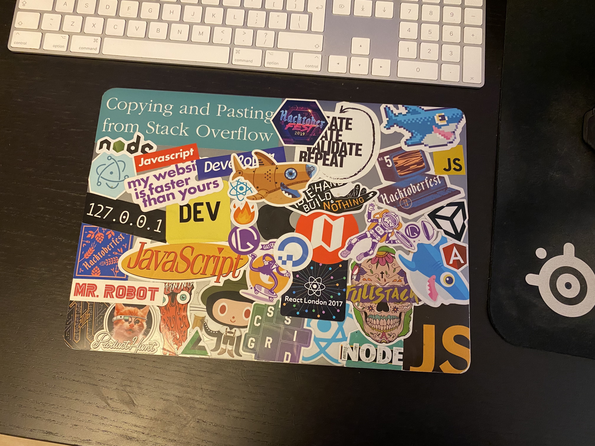
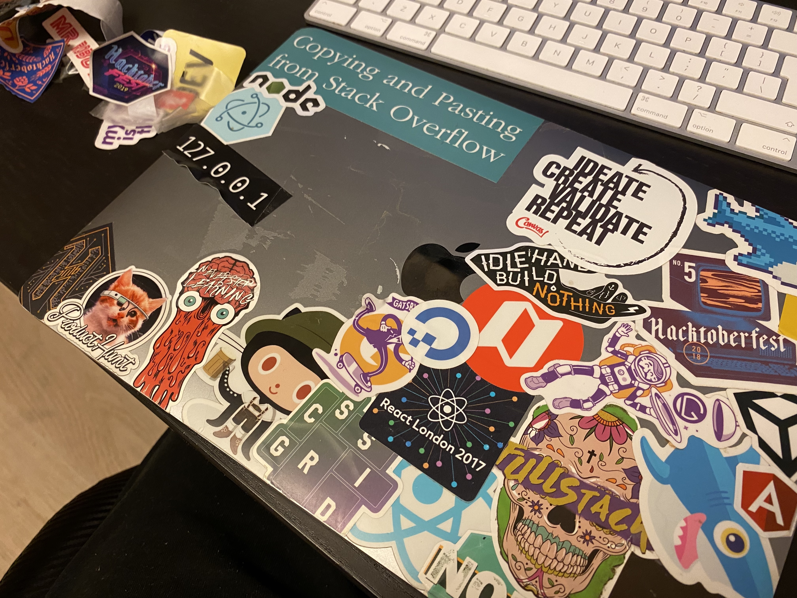
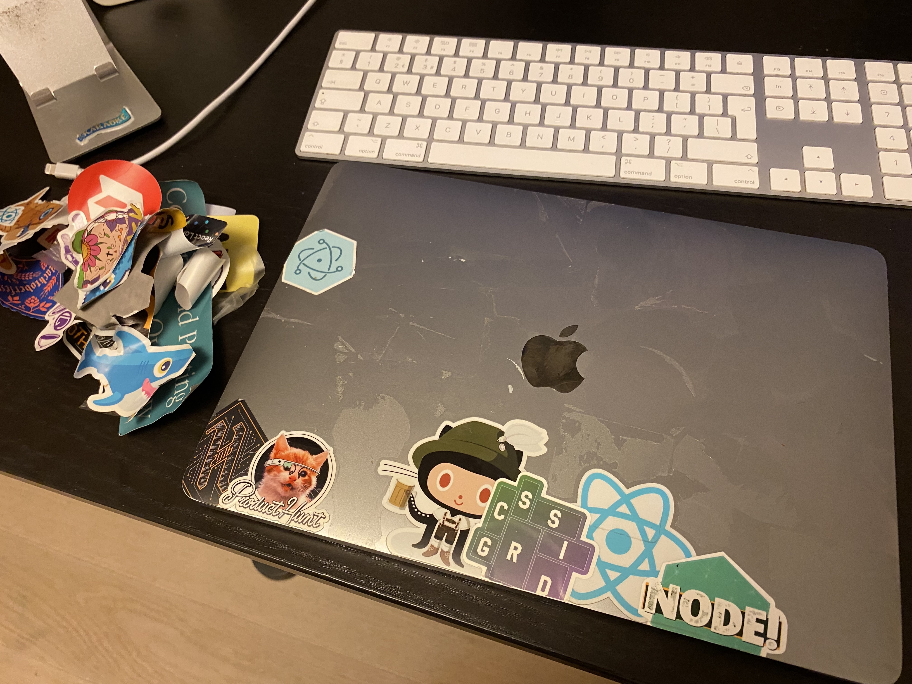
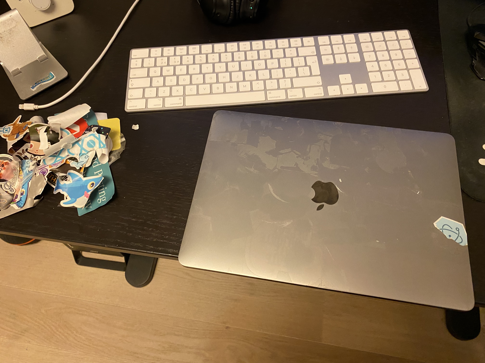
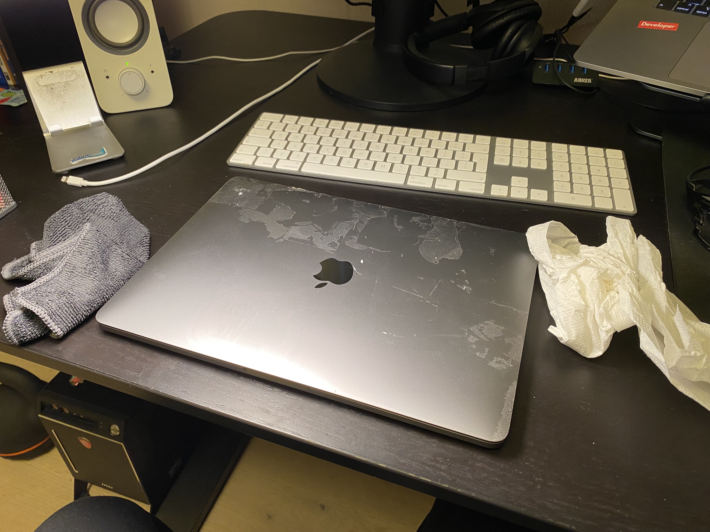
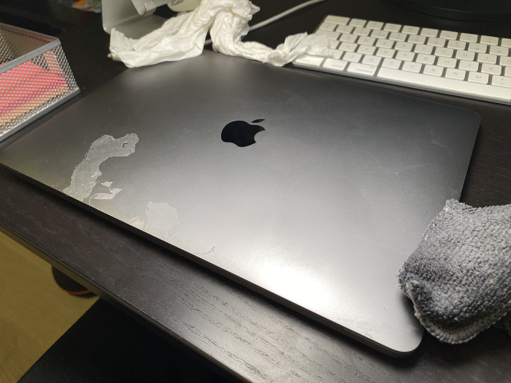
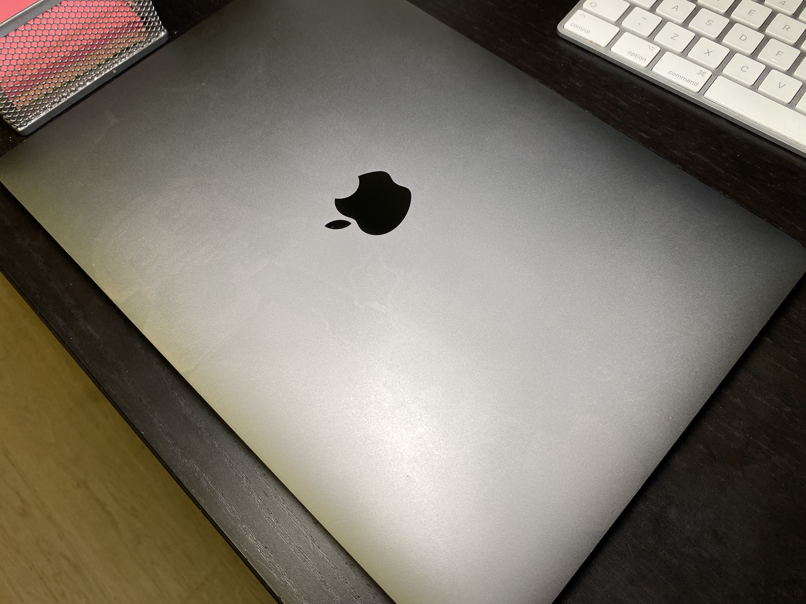

Six years ago, I bought my old Macbook Pro and recently upgraded, so it was time to factory reset and removed all the stickers I had collected over the years.

I started by grabbing a corner of the sticker and using brute force to pull it up. For some, it was easy to remove, but others were not. I also tried using a credit card, but it was no match for my fingernails.

Once I had removed all the stickers, I was left with a laptop full of sticky residue in its place. To remove it, I put a damp rag under hot water and used it on the sticky spots in circular motions. I kept the rag warm by regularly putting it back under the hot water. I considered adding a few drops of dish soap, but it worked just fine without it. Lastly, I turned my laptop off in case I made a mistake.

